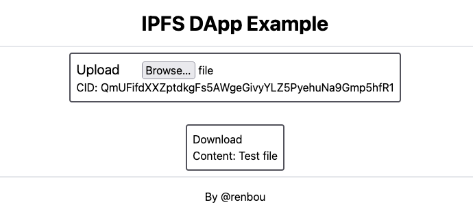

# IPFS DApp Example
An example of integrating IPFS and smart contracts using a DApp with basic upload/download functionality.
The whole app consists of a frontend, which is deployed to IPFS and served over IPFS' HTTP Gateway,
as well as an Ethereum node (hardhat-based) where the contract itself is deployed.



## Usage
Local deployment is bundled for ease of use into a single [docker-compose](https://docs.docker.com/compose/) file with a [Makefile](./Makefile) for control.
Here's how to get going:

1. Run the IPFS and Eth nodes, deploy the frontend onto IPFS (no separate node instance!) and the smart contract onto the Eth node
```bash
make up
```

2. View the logs, and find the CID of the app uploaded to IPFS in a line of the format "added QmTfPdEiYp8bA2WfuQQHU5QM8WdSbgLKEirniMvTKKjXdt app" 
```bash
make logs
```

3. Open `http://localhost:8080/ipfs/{CID}` using the found CID and enjoy the example!

4. Stop the example
```bash
make down
```

## Configuration
The DApp can be configured using [frontend/config.json](./frontend/config.json):
```json
{
  "ipfs": "http://localhost:5001", // Address of the IPFS node used for uploads/downloads
  "node": "http://localhost:8545/", // Address of the JsonRpc Eth node
  "contract": "0x5fbdb2315678afecb367f032d93f642f64180aa3", // Storage contract address
  "privateKey": "0xac0974bec39a17e36ba4a6b4d238ff944bacb478cbed5efcae784d7bf4f2ff80" // Private key of the account used for making all transactions
}
```

## Info
For simplicity, all transactions are made using a single address/account, specified using the private key in the config. Technically, the smart contract allows storing a file per address, however, that would require setting up Metamask/etc, which seems overkill for a simple example...  

The CIDs returned by IPFS are stored in the smart contract using a compact binary representation to avoid wasting space.  